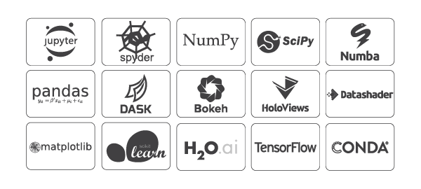

# 자연어처리 튜토리얼  by  Jin-Hwan CHO

### 2019년 9월 17일(화) @한국외국어대학교
### https://github.com/chofchof/nlp-tutorial


# Lesson 1: 개발 환경

## Conda, GitHub & Jupyter Lab

### A. Anaconda = `conda` + `python` + packages
### https://www.anaconda.com/distribution/




### B. Miniconda = `conda` + `python`

### https://docs.conda.io/en/latest/miniconda.html


### https://repo.anaconda.com/miniconda/


### C. [Getting started with conda](https://docs.conda.io/projects/conda/en/latest/user-guide/getting-started.html)


```bash
conda --version
conda --help
conda info
```

```bash
conda info --envs
conda create --name nlp_tutorial python=3.7 jupyterlab
```

```bash
conda info --envs
conda activate nlp_tutorial
jupyter lab
```

```bash
conda deactivate
conda remove --name nlp_tutorial --all
conda info --envs
```

```bash
conda search git
conda install git
```

[Conda Cheat sheet (PDF)](https://docs.conda.io/projects/conda/en/latest/_downloads/1f5ecf5a87b1c1a8aaf5a7ab8a7a0ff7/conda-cheatsheet.pdf)


### D. Linux utilities with conda

```bash
conda search grep
conda install m2-grep
conda list | grep git
conda remove m2-grep
```


### E. GitHub

```bash
git clone https://github.com/chofchof/nlp-tutorial.git
```


### F. Jupyter Lab

```bash
jupyter lab
```

1. [Other] -> [Text File]
   - 한글이 들어있는 텍스트 파일(`test.txt`)을 만들어라.
   - 이 텍스트 파일의 인코딩은? UTF-8 or CP949?

2. [Other] -> [Terminal]

  ```bash
  type test.txt
  conda install m2-libiconv m2-libintl
  iconv -f UTF-8 -t CP949 test.txt > test_cp949.txt
  type test_cp949.txt
  ```

3. [Other] -> [Markdown File]
   - 마크다운 파일(`test.md`)을 만들어라.
   - Show Markdown Preview?
   - 마크다운 에디터 [Typora](https://typora.io)
4. [Notebook] & [Console]
5. [Other] -> [Contextual Help] 는 어떻게 사용하는가?


# Lesson 2: 형태소 분석

## KoNLPy & MeCab

### [KoNLPy](http://konlpy.org/ko/latest/): 파이썬 한국어 NLP

- KoNLPy("코엔엘파이"라고 읽습니다)는 한국어 정보처리를 위한 파이썬 패키지입니다.

  ```bash
  conda search konlpy
  pip search konlpy
pip install konlpy
  pip show konlpy
  conda list
  ```
  
  ```python
  import konlpy
  kkma = konlpy.tag.Kkma()
  
  kkma.morphs("네, 안녕하세요. 반갑습니다.")
  
  kkma.nouns("질문이나 건의사항은 깃헙 이슈 트래커에 남겨주세요.")

  kkma.pos("오류보고는 실행환경, 에러메세지와함께 설명을 최대한상세히!^^")
  ```
  
  ```python
  import konlpy
  mecab = konlpy.tag.Mecab()
  
  mecab.morphs("네, 안녕하세요. 반갑습니다.")
  
  mecab.nouns("질문이나 건의사항은 깃헙 이슈 트래커에 남겨주세요.")
  
  mecab.pos("오류보고는 실행환경, 에러메세지와함께 설명을 최대한상세히!^^")
  ```


### 한국어 형태소 분석기 성능 비교 (https://iostream.tistory.com/144)

- 사용할 데이터의 특성(띄어쓰기 유무 등)이나 개발 환경(Python, Java)에 따라서 적합한 형태소 분석기를 고려해야함

- 연산 속도가 중요하다면 mecab을 최우선으로 고려해야하며, 심지어 분석 품질도 상위권으로 보여짐

- 자소 분리나 오탈자에 대해서도 어느 정도 분석 품질이 보장되야 한다면 KOMORAN 사용을 고려

- 한나눔과 khaiii는 일부 케이스에 대한 분석 품질, 꼬꼬마는 분석 시간에서 약간 아쉬운 점이 보임

  

  시간이 오래걸리는 꼬꼬마 분석기를 제외하고 10만 문장까지 늘려서 분석 시간을 체크해봤습니다.


### [MeCab](https://taku910.github.io/mecab/): Yet Another Part-of-Speech and Morphological Analyzer

- MeCabは[ 京都大学情報学研究科−日本電信電話株式会社コミュニケーション科学基礎研究所 共同研究ユニットプロジェクト](http://pine.kuee.kyoto-u.ac.jp/KU-NTT-WS-2005/)を通じて開発されたオープンソース形態素解析エンジンです。言語, 辞書,コーパスに依存しない汎用的な設計を基本方針としています。パラメータの推定に Conditional Random Fields ([CRF](http://www.cis.upenn.edu/~pereira/papers/crf.pdf)) を用いており, [ChaSen](http://chasen.naist.jp)が採用している隠れマルコフモデルに比べ性能が向上しています。また、平均的に[ChaSen](http://chasen.naist.jp), [Juman](http://www.kc.t.u-tokyo.ac.jp/nl-resource/juman.html),[KAKASI](http://kakasi.namazu.org)より高速に動作します。ちなみに和布蕪(めかぶ)は, 作者の好物です。
- **2013-02-18** MeCab 0.996


### [은전한닢 프로젝트](http://eunjeon.blogspot.com) / mecab-ko

- **2015-02-26** mecab-ko-0.9.2
- https://bitbucket.org/eunjeon/mecab-ko/downloads/

### [은전한닢 프로젝트](http://eunjeon.blogspot.com) / mecab-ko-dic

- mecab-ko-dic은 오픈 소스 형태소 분석 엔진인 MeCab을 사용하여, 한국어 형태소 분석을 하기 위한 프로젝트입니다. 말뭉치 학습과 사전 목록은 모두 21세기 세종계획의 성과물을 사용하였습니다.

- **2018-07-20** mecab-ko-dic-2.1.1
- https://bitbucket.org/eunjeon/mecab-ko-dic/downloads/

### [은전한닢 프로젝트](http://eunjeon.blogspot.com) / mecab-python

- MeCab에서 제공하는 python 바인딩 소스가 Python 3.x에서 문제를 일으키므로 SWIG를 최신 버전(SWIG 3.0.0)을 사용하여 다시 생성한 소스입니다.

- **2014-05-16** mecab-python-0.996
- https://bitbucket.org/eunjeon/mecab-python-0.996/downloads/


### [Pusnow](https://www.pusnow.com) / mecab-ko-msvc

- **2017-07-01 (release-0.9.2-mscv-3)** [mecab-ko-msvc-x64.zip](https://github.com/Pusnow/mecab-ko-msvc/releases/download/release-0.9.2-msvc-3/mecab-ko-msvc-x64.zip)
- https://github.com/Pusnow/mecab-ko-msvc/releases

  ```bash
  conda install m2-unzip
  unzip mecab-ko-msvc-x64.zip -d c:/mecab
  ```

### [Pusnow](https://www.pusnow.com) / mecab-ko-dic-msvc

- **2018-07-28 (mecab-ko-dic-2.1.1-20180720-msvc)** [mecab-ko-dic-msvc.zip](https://github.com/Pusnow/mecab-ko-dic-msvc/releases/download/mecab-ko-dic-2.1.1-20180720-msvc/mecab-ko-dic-msvc.zip)
- https://github.com/Pusnow/mecab-ko-dic-msvc/releases

  ```bash
  unzip mecab-ko-dic-msvc.zip -d c:/mecab
  ```

### [Pusnow](https://www.pusnow.com) / mecab-python-msvc

- **2018-07-20 (mecab_python-0.996_ko_0.9.2_msvc-2)** [mecab_python-0.996_ko_0.9.2_msvc-cp37-cp37m-win_amd64.whl](https://github.com/Pusnow/mecab-python-msvc/releases/download/mecab_python-0.996_ko_0.9.2_msvc-2/mecab_python-0.996_ko_0.9.2_msvc-cp37-cp37m-win_amd64.whl)
- https://github.com/Pusnow/mecab-python-msvc/releases

  ```bash
  pip install mecab_python-0.996_ko_0.9.2_msvc-cp37-cp37m-win_amd64.whl
  conda list
  ```

  
  ```python
  import konlpy
  mecab = konlpy.tag.Mecab()
  
  mecab.morphs("네, 안녕하세요. 반갑습니다.")
  
  mecab.nouns("질문이나 건의사항은 깃헙 이슈 트래커에 남겨주세요.")
  
  mecab.pos("오류보고는 실행환경, 에러메세지와함께 설명을 최대한상세히!^^")
  ```


### How to use MeCab API directly

```python
import MeCab
MeCab.VERSION

s = "네, 안녕하세요. 반갑습니다."

# 1st method
t = MeCab.Tagger()
print(t.parse(s))

# 2nd method
m = t.parseToNode(s)
while m:
    print(m.surface, '\t', m.feature)
    m = m.next
    
# 3rd method
l = MeCab.Lattice()
l.set_sentence(s)
t.parse(l)
m = l.bos_node()
while m:
    print(m.surface, '\t', m.feature)
    m = m.next
l.clear()
```


# Lesson 3: NLP with Scikit-learn

## CountVectorizer & TfidfVectorizer

[Text_Feature_Extraction.ipynb](Text_Feature_Extraction.ipynb)

